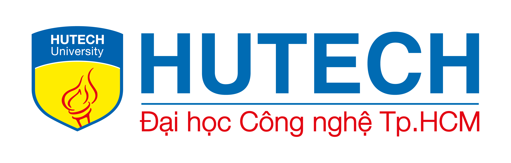

<p align="center">
	
</p>

<h1 align="center">Smart Shopping System</h1>

<p align="center">
	Smart Shopping System based on the user's recent shopping receipts, the application uses a neural network to suggest products or services that the user may be interested in in the future.
<p>

<p align="center">
  <a href="#" rel="dofollow" target="blank"><strong>Explore the docs »</strong></a>
	<br/>
	<br/>
	<a href="https://github.com/NguyenTriBaoThang/SmartShoppingSystem/issues/new?assignees=&labels=&projects=&template=bug_report.md&title=%F0%9F%90%9B+Bug+Report%3A+">🐛 Report Bug</a>
	|
	<a href="https://github.com/NguyenTriBaoThang/SmartShoppingSystem/issues/new?assignees=&labels=&projects=&template=feature_request.md&title=%F0%9F%9A%80+Feature%3A+">✈️ Request Feature</a>
	|
	<a href="#">💬 Join Our Telegram</a>
	|
	<a href="https://github.com/NguyenTriBaoThang/SmartShoppingSystem/wiki">📚 Read Wiki</a>
	|
	<a href="https://github.com/NguyenTriBaoThang/SmartShoppingSystem/projects?query=is%3Aopen">📋 Roadmap</a>
</p>

<p align="center">
	<a href="https://github.com/NguyenTriBaoThang/SmartShoppingSystem/issues" target="blank">
		
	</a>
	<a href="https://github.com/NguyenTriBaoThang/SmartShoppingSystem/blob/main/LICENSE" target="blank">
		
	</a>
	<a href="https://gitpod.io/new/#https://github.com/NguyenTriBaoThang/SmartShoppingSystem" target="_blank">
		
	</a>
		<a href="#" target="_blank">
		
	</a>
</p>


<br/>

<p align="justify">

⚙️ This project used **SonarCloud** to analyze the code quality of the project. **Pulumi** for infrastructure as code (IaC). The badge below shows the quality of the code. Click on the badge to see the details.

</p>

<br/>

<p align="center">
	<a href="#" target="blank">
		
	</a>
	<a href="#" target="blank">
		
	</a>
</p>

<h1>Features</h1>

- 📖 Document Organization and Linking
- 📦 Terminology Extraction
- 🔍 Quick Search for Related Content

<h1>Table of Contents</h1>

<details>
<summary>Expand contents</summary>

- [Tentative technologies](#tentative-technologies)
- [Getting Started](#getting-started)
  - [🛠️ Prerequisites](#️-prerequisites)
  - [🧑‍💻 Setup](#-setup)
  - [🧪 Testing](#-testing)
  - [🧩 Other](#-other)
- [Contributor](#contributor)
- [Support and Organization](#support-and-organization)
- [License](#license)

</details>

# Tentative technologies

- [Next.js](https://nextjs.org/)
- [NestJS](https://nestjs.com/)
- [Python](https://www.python.org/)

# Getting Started

## 🛠️ Prerequisites

<ul>
	<li align="justify">
		<b><a href="https://nx.dev/" target="_blank">Nx</a></b> - Nx is a set of extensible dev tools for monorepos.
	</li>
	<li align="justify">
		<b><a href="https://nodejs.org/en/" target="_blank">Nodejs</a></b> - Node.js® is a JavaScript runtime built on Chrome's V8 JavaScript engine.
	</li>
	<li align="justify">
		<b><a href="https://www.npmjs.com/" target="_blank">pnpm</a></b> - Fast, disk space efficient package manager.
	</li>
	<li align="justify">
		<b><a href="https://www.python.org/" target="_blank">Python</a></b> - Python is a programming language that lets you work quickly and integrate systems more effectively.
	</li>
	<li align="justify">
		<b><a href="https://python-poetry.org/" target="_blank">Poetry</a></b> - Poetry helps you declare, manage and install dependencies of Python projects, ensuring you have the right stack everywhere.
	</li>
	<li align="justify">
		<b><a href="https://www.pulumi.com/" target="_blank">Pulumi</a></b> - Pulumi is a manage infrastructure, secrets, and configurations intuitively on any cloud.
	</li>
	<li align="justify">
		<b><a href="https://www.docker.com/" target="_blank">Docker (Kubernetes Enabled)</a></b> - Docker is an open platform for developing, shipping, and running applications.
	</li>
	<li align="justify">
		<b><a href="https://helm.sh/" target="_blank">Helm</a></b> - Helm is the best way to find, share, and use software built for Kubernetes.
	</li>
	<li align="justify">
		<b><a href="https://dapr.io/" target="_blank">Dapr</a></b> - Dapr is a portable, event-driven runtime that makes it easy for developers to build resilient, microservice stateless and stateful applications that run on the cloud and edge and embraces the diversity of languages and developer frameworks.
	</li>
</ul>

## 🧑‍💻 Setup

First, clone the repository to your local machine:

```bash
git clone https://github.com/NguyenTriBaoThang/SmartShoppingSystem
```

Next, navigate to the root directory of the project and install the dependencies:

```bash
pnpm install --force
```

## 🧪 Testing

For the website, you can run the following command:

```bash
npx nx test webfront-e2e
```

To test the model, you can run the following command:

```bash
npx nx test model
```

## 🧩 Other

To run the tooling for processing the dataset, you can run the following command:

```bash
npx nx serve proc
```

For running documentation, you can run the following command:

```bash
npx nx serve docs
```

# Contributor

<p align="justify">

Thanks goes to these wonderful people ([emoji key](https://allcontributors.org/docs/en/emoji-key))

</p>

<div align="center">
	<table>
		<tr>
			<td align="center" valign="top">
					
	        <br>
	        <a href="https://github.com/NguyenTriBaoThang">Bao Thang</a>
	        <p>
	          <a href="https://github.com/NguyenTriBaoThang/SmartShoppingSystem/commits?author=NguyenTriBaoThang" title="Developer">💻</a>
              <a href="#docs" title="Documentation">📖</a>
	        </p>
			</td>
			<td align="center" valign="top">
					
	        <br>
	        <a href="https://github.com/thuananwork">Thuan An</a>
	        <p>
	          <a href="https://github.com/NguyenTriBaoThang/SmartShoppingSystem/commits?author=thuananwork" title="Developer">💻</a>
	        </p>
			</td>
            <td align="center" valign="top">
					
	        <br>
	        <a href="https://github.com/HTD-0307">Thanh Do</a>
	        <p>
	          <a href="https://github.com/NguyenTriBaoThang/SmartShoppingSystem/commits?author=HTD-0307" title="Developer">💻</a>
	        </p>
			</td>
		</tr>
	</table>
</div>

# Support and Organization

<p align="center">
	<a href="https://hutech.edu.vn/" target="_blank">
		
	</a>
</p>

# License

<p align="justify">

This project is licensed under the terms of the [MIT](LICENSE) license.

</p>
